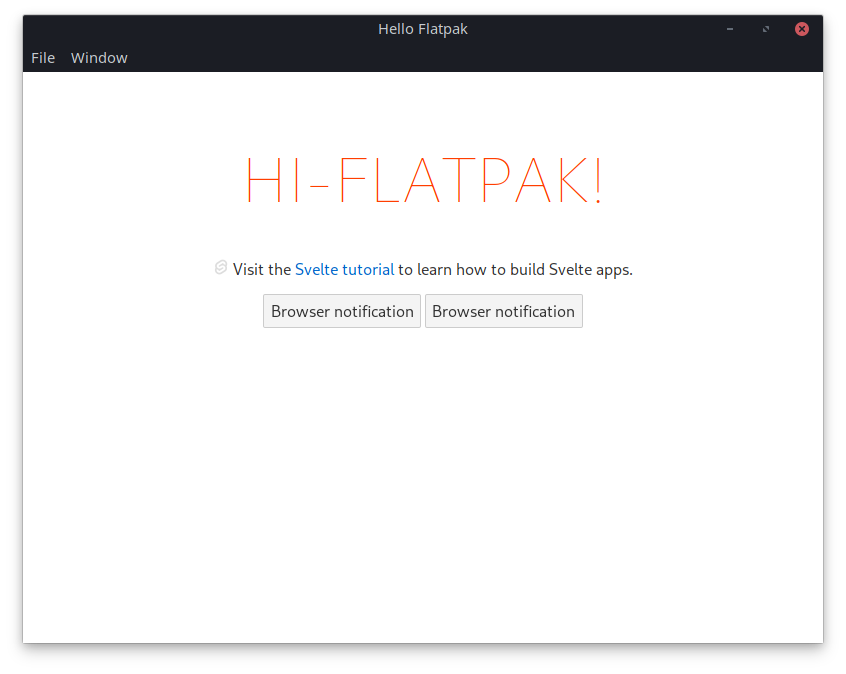

# Hello Flatpak

_Will you bring us the future?_

Experimenting with flatpak bundling for [Tauri](https://tauri.app/).

### Notes

- On Ubuntu the `flatpak` and `flatpak-builder` packages are available from 18.04 LTS (bionic).
  However the `flatpak-builder` in bionic is rather old and doesn't support the manifests Tauri uses currently.

### Todo

- Flathub templates
- GH action releasing artifacts
- Multiple architectures
